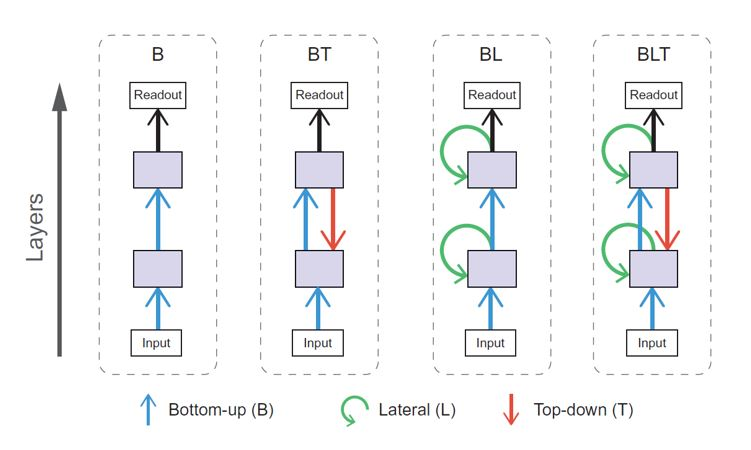
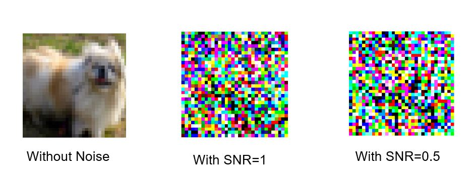
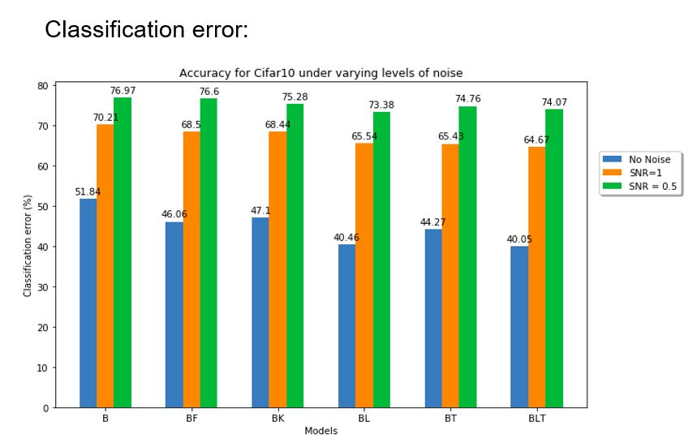

# RCNN-A-Better-Model-for-Biological-Object-Recognition
Implements the part of research paper: https://www.frontiersin.org/articles/10.3389/fpsyg.2017.01551/full.

I have used the Cifar-10 dataset to compare the performaces of recurrent convolutional neural networks with bottom-up (B), lateral (L), and top-down (T) connections with that of the conventional CNN(feed-forward) model. Since comparing the feedforward models with the recurrent models is not fare enough as recurrent models will have more number of parameters than the feedforward models. To overcome this issue I have used two varients of feedforward models (BF) by increasing the size of the kernel and (BK) by incresing the number of the filters.

# Prerequisite
* Tensorflow 2.0
* Keras
* Numpy
* Matplotlib

# Dataset
Cifar10 Dataset with different variations
* Without Noise
* With Noise level 1
* With Noise level 2

# Using Code
Models folder contains the code for both Without Noise and With Noise. In case of With Noise, you need to change the level of the noise (1 or 2) while adding it to the original dataset. And same applies for the names while saving model weights or even the predictions.

# Results

* Classification error increases as the noise level increases.
* Error rate is less in case of Recurrent Networks as compared to Feedforward networks.

### Accuracy of each of the model in percentage

| Image Set | B | BF | BK | BL | BT | BLT |
|-----------|---|----|----|----|----|-----|
|No Noise | 48.16 | 53.94 | 52.90 | 59. 54 | 55.27 | 59.95 |
|With SNR=1 | 29.79 | 31.50 | 31.56 | 34.46 | 34.57 | 35.33 |
|With SNR=2 | 23.03 | 23.40 | 24.28 | 26.62 | 25.24 | 25.93 |

# Hypothesis Test
McNemars test is used for statistical test. Matrices to the right indicate significant results of pairwise McNemar tests. Comparisons are across models and within image sets. Black boxes indicate significant differences at p < 0.05 when controlling the expected false discovery rate at 0.05.

##### H0: No difference detween the models
##### H1: Significant difference between the models

